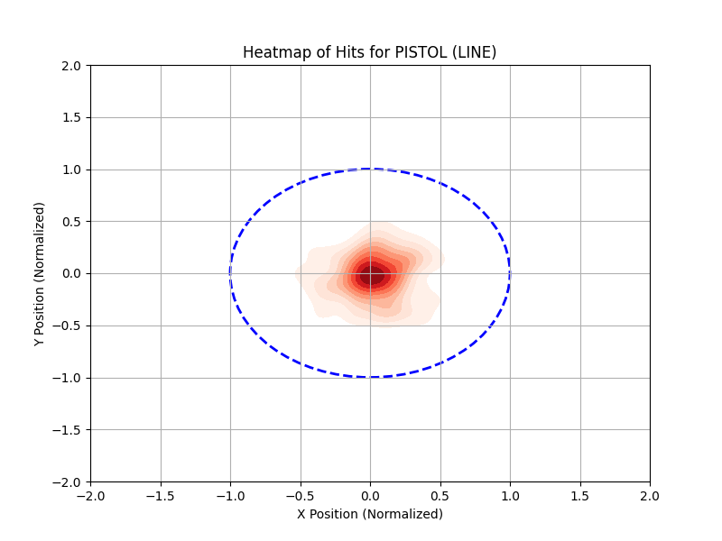
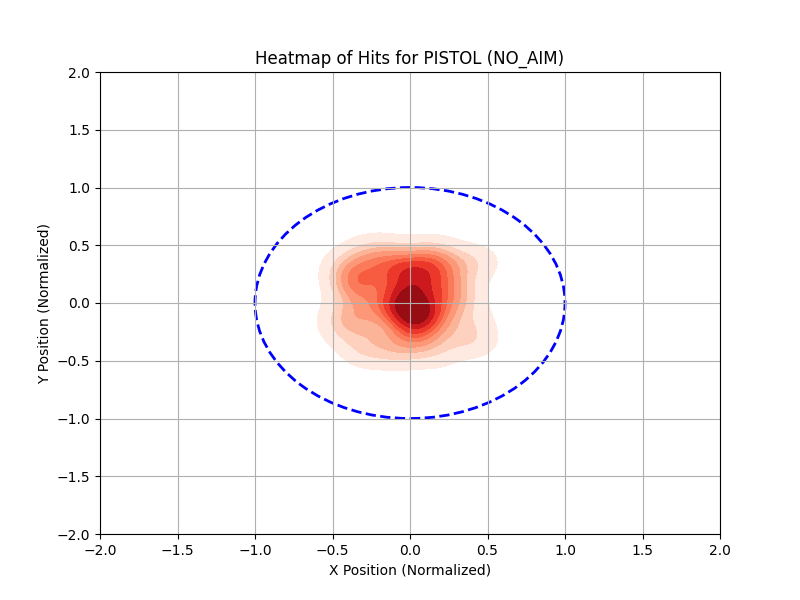
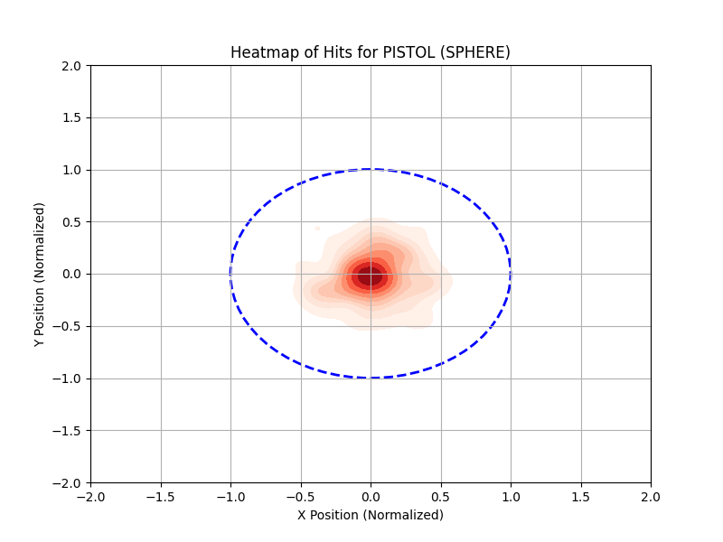
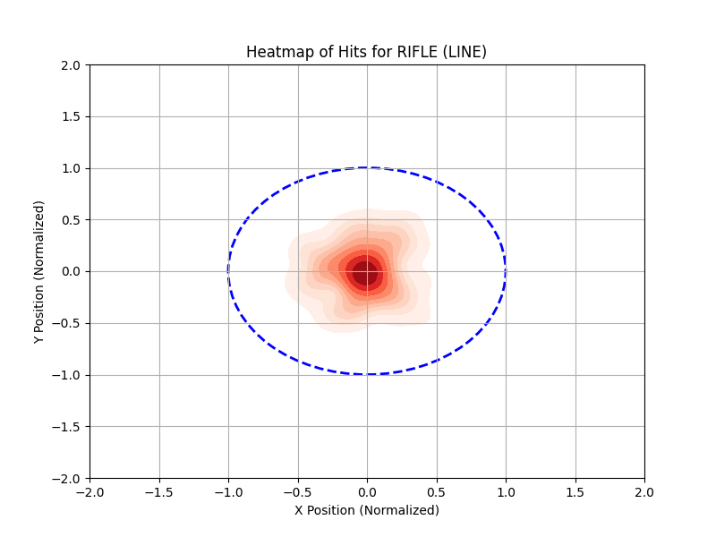
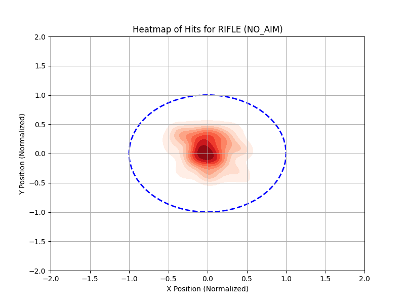
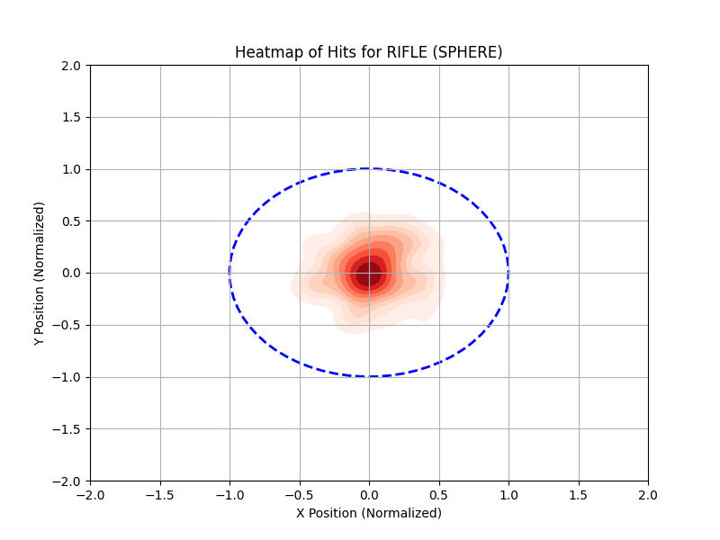
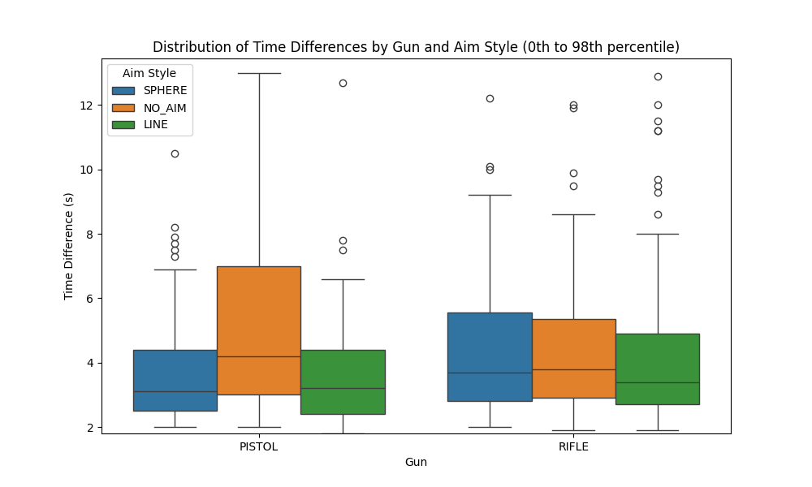

# Data Analysis Process

## Project structure:
The project is organized as follows:
.
├── funcs.py
├── imgs/
├── main.py
├── media.py
├── normalize.py
├── processed\_data/
├── raw\_data/
└── tmp/

## Data Collection and Normalization

All raw data is stored in the `raw_data` folder.  
The data is initially stored in an inconsistent format. To simplify data analysis, we normalize it into a structured format using `normalize.py`.  

### Normalizing Data
Run the following command to normalize a session file:  
```bash
python3 normalize.py session_name.csv
```

The normalized dataset contains the following columns:
Columns:
- **TestID**: Session identifier.
- **Timestamp**: Event time.
- **ElapsedTime**: Time since session start.
- **InitiatedAction**: Action type (e.g., "Destroyed," "Hit", "Missed").
- **TargetType**: Target type (e.g., "STATIC\_MOTION").
- **Gun**: Weapon used (e.g., "PISTOL").
- **AimStyle**: Aim style (e.g., "SPHERE").
- **Position**: Coordinates for hits (for hit actions) or bullseye (for destroyed actions).

#### Important Notes:

- A "destroyed" action is logged when the object in Unity is destroyed.
- A "hit" action is logged when the raycast hits the object.
- Destroyed and hit actions can be linked because they share the same Timestamp.

#### Manual Adjustments

Some manual adjustments were required for unmatched hit/destroy pairs and missing data. For example:

- Removing unmatched hit/destroy pairs.
- Adding missing Gun and AimStyle information for "Missed" actions.

## Analysis in main.py

The main.py script performs data analysis across all sessions. Run it with the following command:

```bash
python3 main.py processed_data/
```

### Calculated Metrics

The script calculates the following metrics for each AimStyle and Gun combination:

- Accuracy
- Average time to destroy the next target
- Average distance from the bullseye

| AimStyle |   Gun   |  accuracy  |  distance  | TimeDiff\_avg |
|----------|---------|------------|------------|--------------|
|   LINE   | PISTOL  |  0.741623  |  0.229698  |   3.648387   |
|   LINE   |  RIFLE  |  0.745041  |  0.276347  |   4.905882   |
|  NO\_AIM  | PISTOL  |  0.488210  |  0.325329  |   6.001124   |
|  NO\_AIM  |  RIFLE  |  0.528857  |  0.291725  |   4.614737   |
|  SPHERE  | PISTOL  |  0.777615  |  0.241265  |   3.700000   |
|  SPHERE  |  RIFLE  |  0.702068  |  0.265935  |   4.692929   |

### Hypothesis Testing

- **Hypothesis**: At least one aim style significantly improves accuracy.
- **Null Hypothesis**: There is no significant difference between aim styles.

To decide what tests we can use, we first need to check for data normality. The Shapiro-Wilk test checks if the accuracy data is normally distributed:

| AimStyle | Statistic |   p-value   |
|----------|-----------|-------------|
|   LINE   |   0.9781  |   0.9279    |
|  NO\_AIM  |   0.9118  |   0.0926    |
|  SPHERE  |   0.9203  |   0.1309    |

From this we can conclude that the data is not normally distributed (p-values > 0.05), and non-parametric tests are required.

Since the data is not normally distributed, we used the **Kruskal-Wallis** test, which is a non-parametric method for comparing medians across groups. Which gave us the following results

- H-statistic: 10.4896  
- P-value: 0.0053

Since the P-value is less than 0.05, we can reject the Null Hypothesis: At least one aim style is significantly different.

The **Dunn test** was chosen as the post hoc test because it is specifically designed for pairwise comparisons following a significant Kruskal-Wallis test.

|         |   LINE   |  NO\_AIM  |  SPHERE  |
|---------|----------|----------|----------|
|  LINE   | 1.000000 | 0.019139 | 1.000000 |
| NO\_AIM  | 0.019139 | 1.000000 | 0.012075 |
| SPHERE  | 1.000000 | 0.012075 | 1.000000 |

The p-values for the comparisons between (SPHERE, NO\_AIM) and (LINE, NO\_AIM) suggest a statistically significant difference in accuracy. This indicates that the choice of aim type significantly impacts accuracy across different sections, as further confirmed by the average accuracy values.

To measure how strong these differences are, we used Cliff's Delta, which gives a clearer picture of the practical impact.

| Comparison          | Cliff's Delta | Effect Size |
|---------------------|---------------|-------------|
| LINE vs NO\_AIM      |     0.54630   |    large    |
| LINE vs SPHERE      |    -0.046296  | negligible  |
| NO\_AIM vs SPHERE    |    -0.54012   |    large    |


The Cliff's Delta results confirm a significant difference in accuracy between NO\_AIM and both LINE and SPHERE. However, the difference between LINE and SPHERE is negligible, suggesting these two aim types perform similarly in terms of accuracy.

## Visualizations

### Heatmaps

Below, we present heatmaps visualizing the performance for every combination of aim type and gun. These heatmaps provide a clear, intuitive representation of the data, highlighting patterns and differences across the tested scenarios.

### Heatmaps

Below are the heatmaps for each combination of **aim type** and **gun**, showcasing the distribution of shots in the target:

#### Pistol Heatmaps
- **LINE Aim**:  
    
  *Heatmap for Pistol with LINE aim.*

- **NO_AIM**:  
    
  *Heatmap for Pistol with NO_AIM.*

- **SPHERE Aim**:  
    
  *Heatmap for Pistol with SPHERE aim.*

#### Rifle Heatmaps
- **LINE Aim**:  
    
  *Heatmap for Rifle with LINE aim.*

- **NO_AIM**:  
    
  *Heatmap for Rifle with NO_AIM.*

- **SPHERE Aim**:  
    
  *Heatmap for Rifle with SPHERE aim.*

The heatmaps show that NO\_AIM has a slightly more spread-out distribution** compared to both LINE and SPHERE** aim types. 

### Boxplot: Time Between Hits

We created a boxplot to visualize the time between hits for each combination of **gun** and **aim type**:

  
*Boxplot showing the time between hits for each gun and aim type combination (0th to 98th percentile).*

The data is trimmed to the 0th to 98th percentile to exclude extreme outliers, ensuring the visualizations remain clear and meaningful.

#### Observations:
- Pistol with NO\_AIM had the longest time between hits, as expected due to the lack of precision.
- For aimed trials, the Pistol was faster than the Rifle, and it was also more accurate with SPHERE aim.
- We interpret this speed difference as a result of the Pistol's **one-handed use**, which allows for freer and quicker movement compared to the Rifle, which requires two hands and more deliberate motion.

## Conclusion:
This analysis highlights the importance of aim types on performance:  
- **NO_AIM** underperformed, with lower accuracy and more spread-out shots.  
- **LINE** and **SPHERE** showed **significantly higher accuracy**, with negligible differences between them.  
- The **Pistol** outperformed the **Rifle** in aimed trials, being faster and more accurate, likely due to its one-handed use.  

Heatmaps and boxplots confirmed these findings, showing tighter shot clusters and faster times for aimed trials. Statistical tests (Kruskal-Wallis, Dunn, Cliff's Delta) validated the significant impact of aim types. These insights can guide future design and training improvements.
